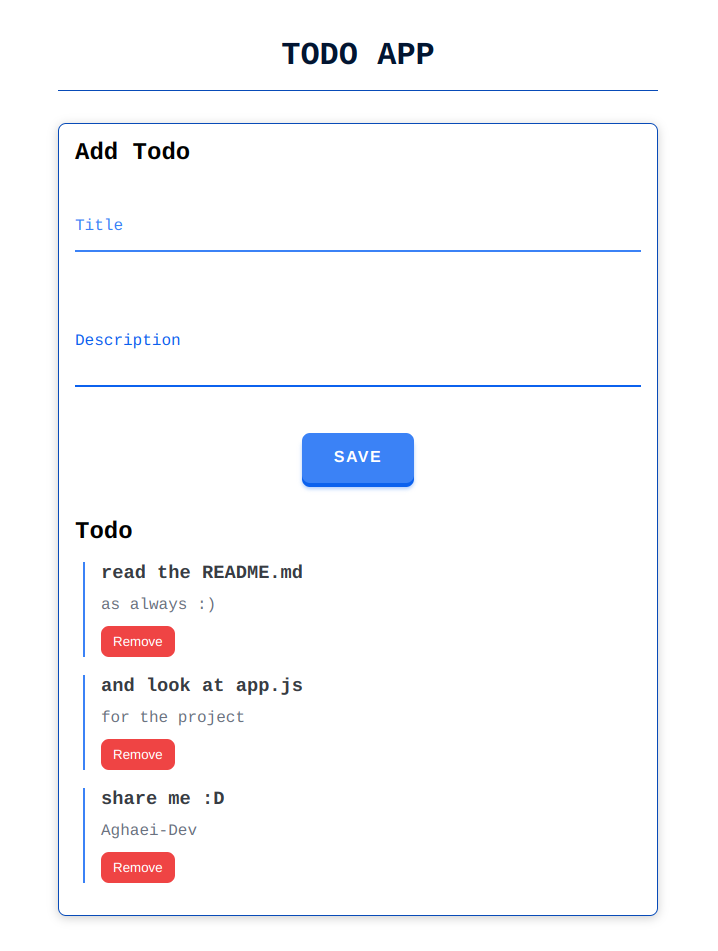
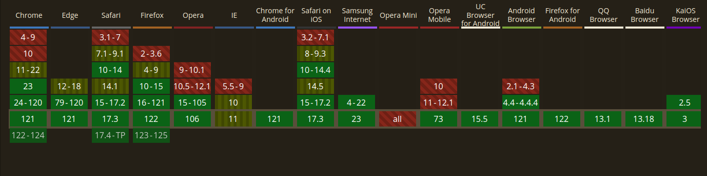

# Indexed DB | Learn With Project



Indexed DB is a low-level API for client-side storage.i mean its a client-side NoSQL (structured query language) database.
.it uses indexes to enable high-performance searches of this data.
another notice you must know IndexedDB Operations are done asynchronously, so as not to block applications.
we have Web Storage that useful for storing smaller data.
so what is that web Storage ?

> Where we store data with Indexed DB ? inside the user's browser . so we can build powerful query abilities regardless of network availability ! so our app works online and also offline too!
> notice this Different websites can’t access each other’s databases!

## Web Storage

its a browser feature that can stores data in key/value pairs.
it has two mode :

- `localStorage` :store the data what ever happens!if you reload its remain . if you close the tab its remain . if you close the browser its remain.you can store data smaller than 10 MB.

- `sessionStorage` :store the data as long as the browser is open, including page reloads and restores.we can just store string data and smaller than 5 MB.

use this hook for both local and session Storage!

```js
import { useState, useEffect } from 'react'

export const useStorage = (type, key, defaultValue) => {
  const [value, setValue] = useState(() => {
    let currentValue

    try {
      currentValue = JSON.parse(
        type === 'localStorage'
          ? localStorage.getItem(key) || String(defaultValue)
          : sessionStorage.getItem(key) || String(defaultValue)
      )
    } catch (error) {
      currentValue = defaultValue
    }

    return currentValue
  })

  useEffect(() => {
    type === 'localStorage'
      ? localStorage.setItem(key, JSON.stringify(value))
      : sessionStorage.setItem(key, JSON.stringify(value))
  }, [value, key, type])

  return [value, setValue]
}
```

## Advantages of Indexed DB

1. you can store more data than `LocalStorage` . it depends on two thing : the browser and your disk space. minimum 1 GB . its great !!! we have approximately 10 MB in the `LocalStorage`.

2. we can also store `ArrayBuffer` and `objects` (i mean almost any kind of values by keys)! . in the `Web Storage` we just can store strings.

3. its available when we are offline . so we can build more efficient PWA Apps!
4. indexing :
5. transactions : so we have more reliable Applications
6. i said before :the operation are done asynchronously, so it not block whole applications.

## How To do that?

follow me step by step :

- Open a database.
- Create an object store in the database.
- Start a transaction and make a request to do some database operation, like adding or retrieving data.
- Wait for the operation to complete by listening to the right kind of DOM event.
- Do something with the results (which can be found on the request object).

with these concepts and steps we can dirty our hands and start some coding !

```js
// name : a string . the name of data base
// version : a positive integer. by default its 1
const openRequest = indexedDB.open(name, version)
```

a simple example that just add item to the db

```js
let db

const reqToOpenDB = indexedDB.open('test', 2)

reqToOpenDB.onupgradeneeded = (e) => {
  db = e.target.result
  console.log('running onupgradeneeded')
  const storeOS = db.createObjectStore('testStore', { keyPath: 'name' })
}

reqToOpenDB.onsuccess = (e) => {
  console.log('running onsuccess')
  db = e.target.result
  addItem({
    name: 'book 1',
    price: '$3.99',
    description: 'It is a book . #1 !',
    created: new Date().getTime(),
  })
  addItem({
    name: 'book 2',
    price: '$0.99',
    description: 'It is a book . #2 !',
    created: new Date().getTime(),
  })
}

reqToOpenDB.onerror = (e) => {
  console.dir(e)
  console.log('we have an error')
}

const addItem = (item) => {
  const tx = db.transaction('testStore', 'readwrite')
  const store = tx.objectStore('testStore')
  store.add(item)
}
```

if you want learn more see the project that attached!

## Can I Use it ?

IndexedDB is supported by modern web browsers, including Chrome, Firefox, Safari, and Edge.we haven't this feature in IE and incognito of firefox! However, it is important to check the specific version of IndexedDB supported by each browser to ensure compatibility.

