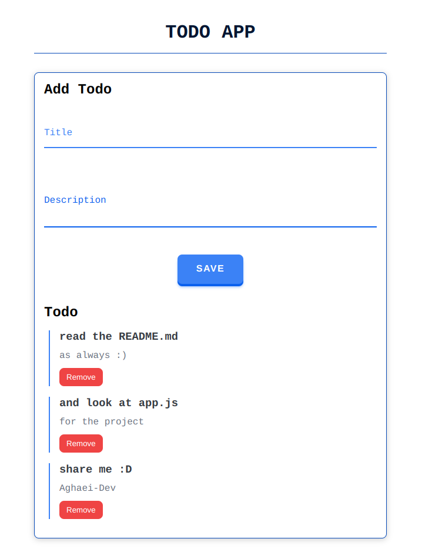
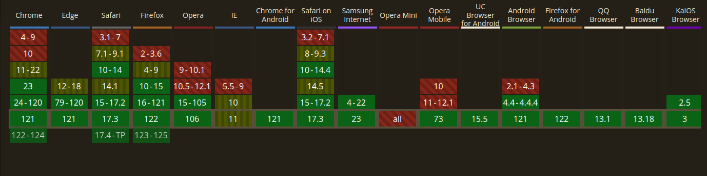

# 📦 IndexedDB | Learn by Project


<p align="center">
  
</p>

**IndexedDB** is a low-level API for client-side storage of significant amounts of structured data, including files/blobs. It’s essentially a **NoSQL** database that runs inside the browser, using indexes to enable high-performance searches.

> Unlike Web Storage (like `localStorage` and `sessionStorage`), IndexedDB provides **asynchronous**, **transactional**, and **powerful** storage capabilities — making it ideal for large data sets and offline-first apps.

---

## 🌐 Why IndexedDB?

- Data is stored **in the user's browser**.
- Enables **offline functionality** for Progressive Web Apps (PWAs).
- Offers **advanced querying**, **indexing**, and **transactions**.
- Data from one website is **inaccessible** to others — ensuring security and isolation.

---

## 🗃️ Web Storage vs IndexedDB

### Web Storage: Quick Overview

Web Storage is ideal for **small, key-value pairs** of data.

| Feature            | `localStorage`                       | `sessionStorage`                      |
|--------------------|--------------------------------------|----------------------------------------|
| Persistence        | Until manually cleared               | Until the tab/browser is closed        |
| Size Limit         | ~10 MB                               | ~5 MB                                  |
| Data Format        | Only strings                         | Only strings                           |
| Use Case           | Preferences, tokens                  | Temporary session data                 |

### Custom React Hook for Web Storage

```js
import { useState, useEffect } from 'react'

export const useStorage = (type, key, defaultValue) => {
  const [value, setValue] = useState(() => {
    try {
      return JSON.parse(
        type === 'localStorage'
          ? localStorage.getItem(key) || JSON.stringify(defaultValue)
          : sessionStorage.getItem(key) || JSON.stringify(defaultValue)
      )
    } catch {
      return defaultValue
    }
  })

  useEffect(() => {
    const storage = type === 'localStorage' ? localStorage : sessionStorage
    storage.setItem(key, JSON.stringify(value))
  }, [value, key, type])

  return [value, setValue]
}
```

---

## 🚀 Advantages of IndexedDB

1. **Storage Capacity**: Much larger than Web Storage (commonly **1GB+**, depending on browser and disk space).
2. **Rich Data Types**: Supports storing **objects**, **arrays**, **blobs**, and **binary data** (`ArrayBuffer`).
3. **Offline Support**: Enables fully functional **offline experiences**.
4. **Indexing**: Create indexes for **efficient querying**.
5. **Transactions**: Provides **ACID-compliant** transactions for reliability.
6. **Asynchronous API**: Prevents UI blocking — all operations are **non-blocking**.

---

## 🛠️ Using IndexedDB: Step-by-Step

Here’s the basic flow:

1. Open a database.
2. Create an object store (like a table in SQL).
3. Use transactions to add/retrieve data.
4. Listen to success/error events to handle results.

### 📄 Example Code

```js
let db;

const request = indexedDB.open('testDB', 2);

request.onupgradeneeded = (event) => {
  db = event.target.result;
  console.log('DB upgrade or initial creation');
  db.createObjectStore('books', { keyPath: 'name' });
};

request.onsuccess = (event) => {
  db = event.target.result;
  console.log('Database opened successfully');

  addItem({
    name: 'book 1',
    price: '$3.99',
    description: 'It is a book. #1!',
    created: Date.now(),
  });

  addItem({
    name: 'book 2',
    price: '$0.99',
    description: 'It is a book. #2!',
    created: Date.now(),
  });
};

request.onerror = (event) => {
  console.error('Database error:', event);
};

const addItem = (item) => {
  const transaction = db.transaction('books', 'readwrite');
  const store = transaction.objectStore('books');
  store.add(item);
};
```

---

## ✅ Can I Use IndexedDB?

Yes! Most modern browsers support it:

- ✅ Chrome
- ✅ Firefox
- ✅ Edge
- ✅ Safari

> ⚠️ Not supported in: **Internet Explorer** and **Firefox Incognito Mode**



---

## 📚 Want to Learn More?

Check out the full project attached to dive deeper with real IndexedDB code examples!
